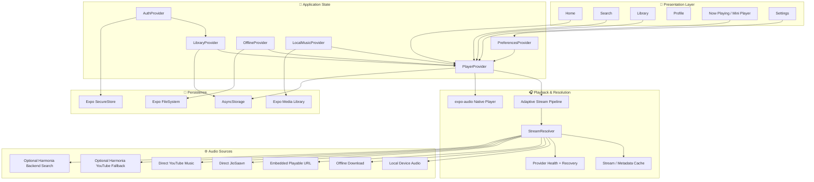
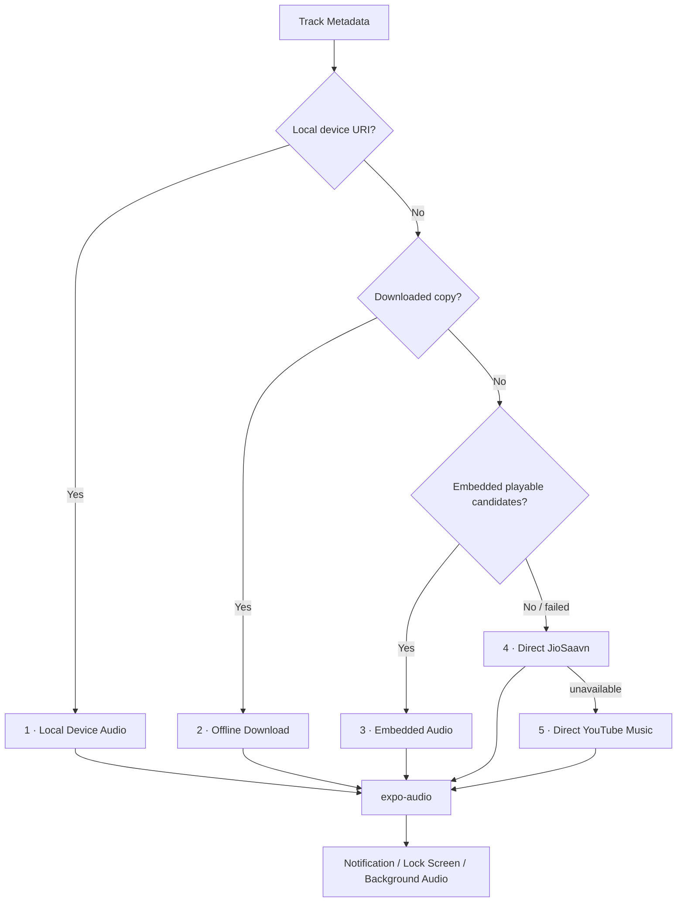
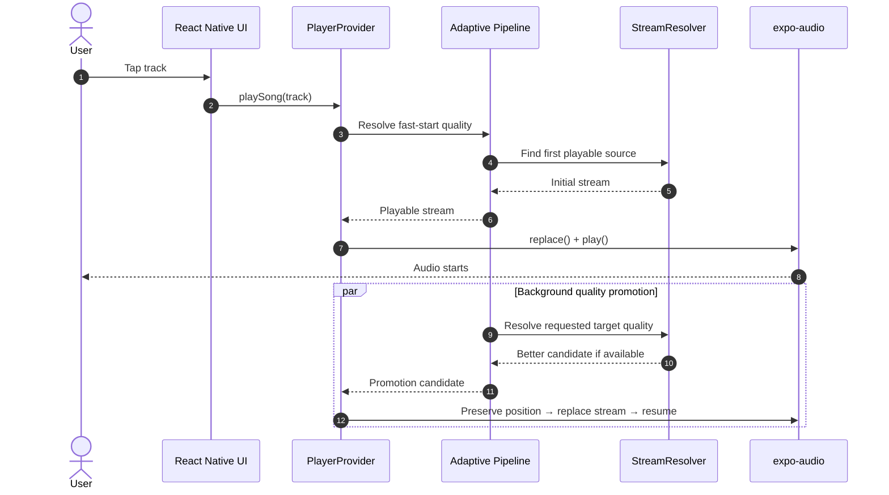
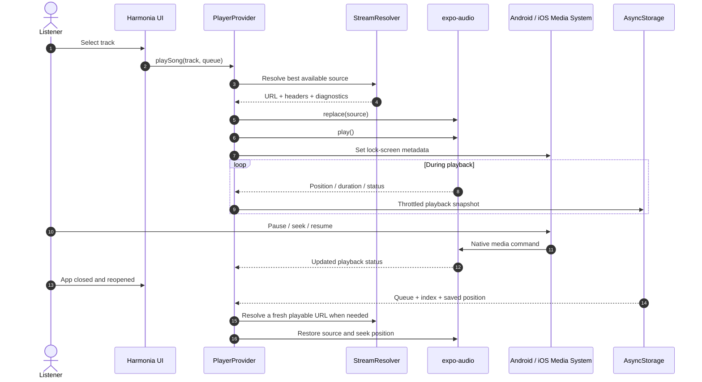

<div align="center">

# 📱 Harmonia Mobile

### Native Harmonia Client · Resilient Multi-Provider Audio · Background Playback · Offline & Local Music

**Harmonia Mobile** is the dedicated React Native client for the Harmonia music ecosystem. It brings Harmonia's catalog, account sync, playlists, liked music, Spotify Canvas, synced lyrics, local-device audio, offline downloads, background playback, lock-screen controls, adaptive stream resolution, and a phone-first Harmonia interface to Android and iOS.

The mobile app is designed to start playback quickly, prefer on-device/direct sources before server fallbacks, recover from stale streams, keep playback state across launches, and reduce unnecessary network, image-decoding, and background work.

<p align="center">
  
  
  
  
  
  
</p>

<p align="center">
  <a href="https://github.com/shreeharsh-patil/Harmonia-mobile/stargazers"></a>
  <a href="https://github.com/shreeharsh-patil/Harmonia-mobile/issues"></a>
  <a href="https://github.com/shreeharsh-patil/Harmonia-mobile/actions/workflows/mobile-ci.yml"></a>
</p>

</div>

---

## ✨ What Harmonia Mobile Includes

- **Home, Search, Library and Profile** bottom-navigation experience
- Persistent **mini-player** above navigation
- Full-screen **Now Playing**
- Native playback powered by **`expo-audio`**
- Background audio with Android notification and lock-screen media controls
- Playback resume after app restart
- Local-device music scanning through **Expo Media Library**
- Offline downloads through **Expo FileSystem**
- Embedded audio candidate playback
- Direct **JioSaavn** resolution
- Direct **YouTube Music / Innertube** fallback
- Spotify Canvas fetched directly by the APK from the configured Canvas service
- Synced lyrics with seekable timed lines and words
- Playlist, liked song, liked album and liked artist synchronization
- Spotify playlist import through the Harmonia backend
- Harmonia Radio / queue continuation
- Replay / local listening statistics
- Sleep timer
- Playback speed control
- Network-aware streaming quality
- Battery Saver behavior
- Playback diagnostics
- Local history and recent searches
- EAS APK / production Android build profiles
- CI coverage for TypeScript, playback behavior, regression tests, catalog sync and Expo configuration

---

# 🏛️ Architecture

Harmonia Mobile separates presentation, account/library state, offline/local media, playback orchestration and stream resolution instead of coupling network requests directly to player screens.



## Provider Composition

The root application composes state in this order:

```text
SafeAreaProvider
└── PreferencesProvider
    └── AuthProvider
        └── LibraryProvider
            └── OfflineProvider
                └── LocalMusicProvider
                    └── PlayerProvider
                        └── Expo Router navigation
```

This keeps account state, library state, device files and playback responsibilities isolated while still allowing the player to consume the information it needs.

---

# 🎧 Audio Resolution Pipeline

The normal playback path prioritizes the fastest and most reliable source closest to the device.



### Resolution order

1. **Local device audio**
2. **Offline downloaded audio**
3. **Embedded playable URLs already attached to the track**
4. **Fresh direct JioSaavn resolution**
5. **Direct YouTube Music / Innertube**

The resolver also maintains:

- quality-aware candidate ranking
- stream URL freshness / expiry handling
- provider health tracking and cooldowns
- bounded request timeouts
- abortable stale requests
- alternate embedded-candidate recovery
- provider fallback after playback failure
- stream metadata diagnostics
- in-memory resolved-stream caching

---

# ⚡ Adaptive Fast-Start Pipeline

For higher quality modes, Harmonia can begin with a faster/lighter stream and promote playback in the background when a meaningfully better stream resolves.



Battery Saver disables unnecessary promotion/prefetch behavior and Canvas rendering where appropriate.

---

# 🔄 Playback Lifecycle



Temporary stream URLs are not trusted as permanent state. Persisted songs are sanitized, and playback resolves fresh provider data when recovery requires it.

---

# 📴 Offline & Local Music

## Offline downloads

Downloads are resolved through the same playback pipeline before being written into Harmonia's private app storage.

```text
Song
→ resolve playable stream
→ infer media container
→ Expo FileSystem download task
→ progress tracking
→ persisted offline index
→ playback prefers downloaded URI next time
```

Download behavior includes:

- Wi-Fi-only option
- network-state checks
- cancellable in-flight downloads
- cleanup of partial files after failure/cancel
- download-index repair if stored metadata becomes invalid
- automatic removal of entries whose files no longer exist

## Local music

Local music scanning is permission-driven and only runs when the user requests it.

Harmonia uses `expo-media-library` to read audio assets and intentionally batches native metadata work instead of opening hundreds of metadata requests simultaneously.

---

# 🎬 Spotify Canvas

Canvas rendering uses `expo-video` and calls the configured Spotify Canvas service directly from the APK. Canvas lookup traffic does not pass through the Harmonia account backend.

Behavior includes:

- Spotify identity extraction from normalized track metadata
- bounded Canvas lookup timeout
- cancellation when the active track changes
- in-memory LRU-style Canvas URL cache
- persistent AsyncStorage Canvas cache (7-day positive TTL, bounded to 200 tracks)
- short negative-result cache to avoid repeated misses
- automatic pause/unmount when the app is backgrounded
- disabled motion when Lyrics, Queue or Tools replaces the artwork view
- Reduced Motion support
- Battery Saver support

Canvas is optional: normal artwork remains available if the backend or Canvas provider cannot resolve animation media.

---

# 📝 Synced Lyrics

Harmonia supports plain and synchronized lyrics through the Harmonia proxy and direct LRCLib fallback.

The mobile lyric layer includes:

- LRC parsing
- timed line highlighting
- timed word highlighting
- tap-to-seek
- binary-search timing lookup for long transcripts
- stale request cancellation
- provider request timeouts
- automatic cancellation when the track changes or Lyrics is closed

---

# 🌐 Backend vs Backendless Operation

Harmonia Mobile is intentionally **local/direct-first**, but account synchronization still uses the existing Harmonia backend.

### Works without the Harmonia account backend

- local-device songs
- downloaded songs
- embedded audio URLs
- direct JioSaavn playback
- direct YouTube Music fallback
- queue / shuffle / repeat
- local history
- local Replay statistics
- Spotify Canvas when `EXPO_PUBLIC_SPOTIFY_CANVAS_API_URL` is configured
- bundled build-time catalog
- playback speed
- sleep timer

### Uses the existing Harmonia backend

- email/password account authentication
- Google / GitHub mobile OAuth bridge
- profile synchronization
- liked songs / albums / artists
- cloud playlists
- Spotify playlist import
- cloud library sync
- server recommendations where available

The app does **not** embed MongoDB credentials or database administration credentials inside the APK.

---

# 💾 Persistence & Security

| Data | Storage |
|---|---|
| Access token | Expo SecureStore |
| Cached account profile | AsyncStorage |
| Playback queue / position | AsyncStorage |
| Playback preferences | AsyncStorage |
| Listening history / Replay stats | AsyncStorage |
| Recent searches | AsyncStorage |
| Offline track index | AsyncStorage |
| Downloaded audio | Expo FileSystem |
| Local device music | Expo Media Library |

The catalog-sync GitHub token is a **build-time secret** only. It is deliberately named `HARMONIA_CATALOG_GITHUB_TOKEN` rather than `EXPO_PUBLIC_...`, so it is not intended to be bundled into the mobile client.

---

# 🎛️ Playback Quality & Power Controls

Available quality modes:

- **Automatic**
- **Data Saver**
- **Normal**
- **High**
- **Maximum**

The resolver currently uses these nominal ceilings where a provider exposes usable bitrate metadata:

| Mode | Candidate ceiling |
|---|---:|
| Data Saver | ~96 kbps |
| Normal | ~160 kbps |
| High | ~320 kbps |
| Maximum | Highest provider candidate |

Maximum is provider-dependent and may include a lossless-marked candidate when one actually exists. Harmonia does not fabricate a bitrate that the upstream source does not provide.

Network-aware quality can maintain separate Wi-Fi and cellular preferences.

Battery Saver can reduce expensive work such as Canvas rendering and next-track preloading.

---

# 🧠 Reliability & Performance Design

The project includes multiple protections specifically aimed at mobile playback stability:

- generation guards against stale async track resolutions
- `AbortController` cancellation for superseded network work
- bounded API/provider timeouts
- source-specific recovery policy
- alternate embedded-stream retries
- provider-health cooldown behavior
- stream URL cache with expiry awareness
- sanitized persisted playback snapshots
- queue persistence throttling
- cached-session startup
- lazy tabs and frozen inactive screens
- virtualized song and playlist lists
- bounded FlatList render batches
- size-aware artwork selection
- `expo-image` memory/disk caching and recycling keys
- Canvas lifecycle cleanup
- stale native preload cleanup
- batched local-media metadata scanning
- hydration race guards for preferences, history, library and downloads

---

# 📂 Project Structure

```text
app/
├── (tabs)/
│   ├── index.tsx          # Home
│   ├── search.tsx         # Search
│   ├── library.tsx        # Library
│   └── profile.tsx        # Profile
├── player.tsx             # Full-screen Now Playing
├── settings.tsx
├── explore.tsx
├── replay.tsx
├── login.tsx
├── import-playlist.tsx
├── album/[id].tsx
├── artist/[id].tsx
├── playlist/[id].tsx
└── mix/[id].tsx

src/
├── components/            # Player, artwork, rows, sheets
├── lib/
│   ├── playback/          # Resolver, providers, errors, cache, recovery
│   ├── api.ts             # Harmonia/catalog/account APIs
│   ├── canvas.ts          # Spotify Canvas lookup
│   ├── lyrics.ts          # Timed lyric parsing
│   └── streamPipeline.ts  # Adaptive fast-start / promotion
├── providers/
│   ├── AuthProvider.tsx
│   ├── LibraryProvider.tsx
│   ├── OfflineProvider.tsx
│   ├── LocalMusicProvider.tsx
│   ├── PlayerProvider.tsx
│   └── PreferencesProvider.tsx
└── types/

assets/
└── catalog/               # Bundled compact Harmonia catalog

scripts/
└── sync-static-catalog.mjs

tests/
└── playback/              # Resolver + production regression coverage
```

---

# 🚀 Local Development

## Prerequisites

- **Node.js 22.13+**
- npm
- Android Studio / Android device for Android native testing
- Xcode / iOS simulator for iOS development on macOS
- EAS CLI for cloud builds

## 1. Clone and install

```bash
git clone https://github.com/shreeharsh-patil/Harmonia-mobile.git
cd Harmonia-mobile
npm install
```

## 2. Configure environment variables

Copy the values you need from `.env.example`.

```env
# Optional Harmonia account/catalog backend.
EXPO_PUBLIC_HARMONIA_API_URL=https://your-harmonia-api.example

# Spotify Canvas service called directly by the APK (public URL, not a secret).
EXPO_PUBLIC_SPOTIFY_CANVAS_API_URL=

```

For EAS/catalog builds, the following are build secrets rather than public app variables:

```env
HARMONIA_CATALOG_GITHUB_TOKEN=github_pat_...
HARMONIA_CATALOG_GITHUB_REF=main
```

The token should have only the repository Contents access needed to read the Harmonia Web catalog source.

## 3. Start development

```bash
npm start
```

or:

```bash
npx expo start
```

## 4. Run validation

```bash
npm run typecheck
npm test
npx expo config --type public
```

To refresh the bundled catalog:

```bash
npm run sync:catalog
```

---

# 📦 EAS Builds

The repository already contains `eas.json`.

### Internal Android APK

```bash
npm run build:apk
```

Equivalent:

```bash
eas build -p android --profile preview
```

The `preview` profile uses:

```json
{
  "distribution": "internal",
  "android": {
    "buildType": "apk"
  }
}
```

### Production Android build

```bash
npm run build:android
```

Equivalent:

```bash
eas build -p android --profile production
```

The production profile uses EAS remote app-version management with automatic build-number incrementing.

---

# ✅ Continuous Integration

`.github/workflows/mobile-ci.yml` validates pushes and pull requests targeting `main`.

CI currently checks:

1. Node 22.13 environment
2. dependency installation
3. Harmonia catalog-sync script
4. TypeScript
5. playback and regression tests
6. public Expo configuration

---

# 🔗 Harmonia Ecosystem

### Mobile application

**Repository:** [shreeharsh-patil/Harmonia-mobile](https://github.com/shreeharsh-patil/Harmonia-mobile)

### Harmonia Web / backend reference

**Repository:** [shreeharsh-patil/Harmonia-Spotify-Downloader](https://github.com/shreeharsh-patil/Harmonia-Spotify-Downloader)

Harmonia Web remains an independent application and acts as the source of truth for shared Harmonia behavior, account APIs, catalog integration and compatible metadata flows. Mobile-specific playback, UI and device integrations live in this repository.

---

# 🧭 Current Engineering Direction

Harmonia Mobile is focused on:

- native-quality mobile playback behavior
- Harmonia Web feature parity where mobile behavior makes sense
- direct/local-first streaming
- minimal dependency on server playback infrastructure
- reliable background playback
- low unnecessary network and decode overhead
- robust recovery from stale provider URLs
- safe persistence and fast reopen behavior
- production-grade mobile ergonomics without turning Harmonia into a generic Spotify clone

---

<div align="center">

### Harmonia Mobile

**Harmonia on your phone — native playback, resilient sources, one synchronized library.**

</div>
