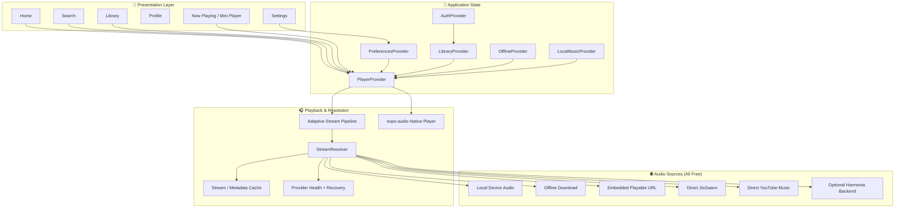
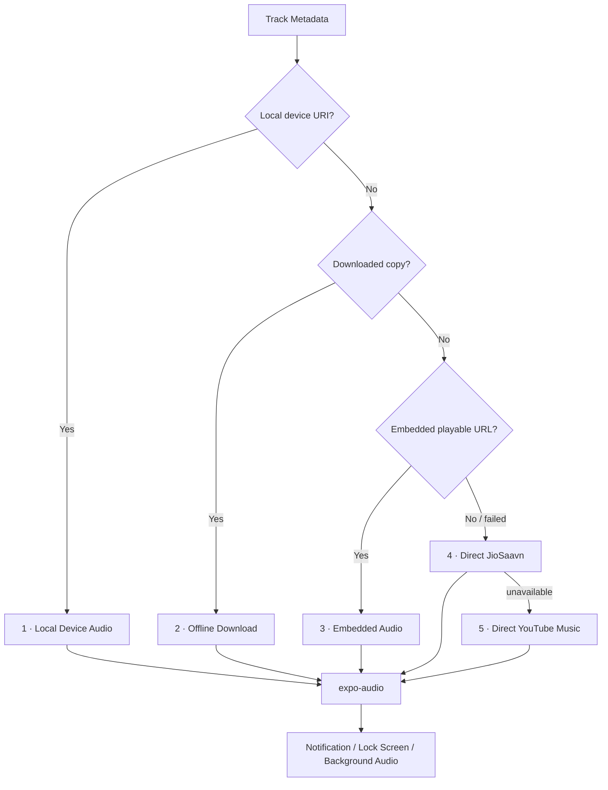

<div align="center">

# 📱 Harmonia Mobile

### Open-Source React Native Music Player · Free Providers Only · Background Playback · Offline & Local Music

**Harmonia Mobile** is a free, open-source music player built with React Native/Expo. It plays music from free, publicly accessible sources — JioSaavn and YouTube Music — with background playback, offline downloads, local-device music, synced lyrics, and a full phone-first UI.

<p align="center">
  
  
  
  
</p>

<p align="center">
  <a href="https://github.com/shreeharsh-patil/Harmonia-mobile/stargazers"></a>
  <a href="https://github.com/shreeharsh-patil/Harmonia-mobile/issues"></a>
</p>

</div>

---

> [!IMPORTANT]
> **Open-Source · Personal Project · No Liability**
>
> This is a personal, open-source project shared for educational and non-commercial use. All audio is sourced from **free, publicly accessible providers** (JioSaavn, YouTube Music, LRCLib). **No Spotify API is used. No Spotify credentials are required. No Spotify content is accessed.**
>
> The developer takes **no responsibility** for how this software is used. Use at your own risk and ensure compliance with the terms of service of any third-party platforms in your region.

---

## ✨ What Harmonia Mobile Includes

- **Home, Search, Library and Profile** bottom-navigation experience
- Persistent **mini-player** above navigation
- Full-screen **Now Playing**
- Native playback powered by **`expo-audio`**
- Background audio with Android notification and lock-screen media controls
- Playback resume after app restart
- Local-device music scanning through **Expo Media Library**
- Offline downloads through **Expo FileSystem**
- Direct **JioSaavn** resolution — free, no API key needed
- Direct **YouTube Music / Innertube** fallback — free, no API key needed
- Synced lyrics via **LRCLib** — free and open
- Playlist, liked song, liked album, and liked artist synchronization (with optional backend)
- Harmonia Radio / queue continuation
- Sleep timer
- Playback speed control
- Network-aware streaming quality
- Battery Saver behavior
- Local history and recent searches
- EAS APK / production Android build profiles

---

## 🎵 Audio Sources

Everything used here is **free and publicly accessible**. No paid API keys are required for core playback.

| Source | Type | Cost |
|---|---|---|
| JioSaavn | Direct resolution | Free |
| YouTube Music / Innertube | Direct fallback | Free |
| LRCLib | Synced lyrics | Free & open-source |
| Local device audio | Expo Media Library | Free |
| Offline downloads | Expo FileSystem | Free |

---

# 🏛️ Architecture

Harmonia Mobile separates presentation, account/library state, offline/local media, playback orchestration and stream resolution.



---

# 🎧 Audio Resolution Pipeline

Playback prioritizes the fastest and most reliable free source closest to the device.



### Resolution order

1. **Local device audio**
2. **Offline downloaded audio**
3. **Embedded playable URLs already attached to the track**
4. **Fresh direct JioSaavn resolution**
5. **Direct YouTube Music / Innertube**

---

# 📴 Offline & Local Music

## Offline downloads

Downloads are resolved through the same playback pipeline before being written into Harmonia's private app storage.

```text
Song
→ resolve playable stream
→ infer media container
→ Expo FileSystem download task
→ progress tracking
→ persisted offline index
→ playback prefers downloaded URI next time
```

- Wi-Fi-only option
- Cancellable in-flight downloads
- Cleanup of partial files after failure/cancel
- Automatic removal of entries whose files no longer exist

## Local music

Local music scanning is permission-driven and only runs when the user requests it. Uses `expo-media-library` to read audio assets.

---

# 📝 Synced Lyrics

Lyrics are sourced from **LRCLib** — a free and open-source lyrics provider.

- LRC parsing
- Timed line highlighting
- Timed word highlighting
- Tap-to-seek
- Automatic cancellation when the track changes

---

# 🌐 Backend vs Backendless Operation

Harmonia Mobile is **local/direct-first**. The optional backend is only needed for account sync features.

### Works completely without any backend

- Local-device songs
- Downloaded songs
- Direct JioSaavn playback
- Direct YouTube Music fallback
- Queue / shuffle / repeat
- Local history
- Synced lyrics via LRCLib
- Playback speed
- Sleep timer
- Bundled build-time catalog

### Requires the optional Harmonia backend

- Email/password account authentication
- Google / GitHub mobile OAuth
- Liked songs / albums / artists sync
- Cloud playlists
- Cross-device library sync

---

# 💾 Persistence & Security

| Data | Storage |
|---|---|
| Access token | Expo SecureStore |
| Cached account profile | AsyncStorage |
| Playback queue / position | AsyncStorage |
| Playback preferences | AsyncStorage |
| Listening history | AsyncStorage |
| Recent searches | AsyncStorage |
| Offline track index | AsyncStorage |
| Downloaded audio | Expo FileSystem |
| Local device music | Expo Media Library |

---

# 🎛️ Playback Quality

| Mode | Candidate ceiling |
|---|---:|
| Data Saver | ~96 kbps |
| Normal | ~160 kbps |
| High | ~320 kbps |
| Maximum | Highest provider candidate |

Network-aware quality can maintain separate Wi-Fi and cellular preferences. Battery Saver reduces expensive work such as next-track preloading.

---

# 📂 Project Structure

```text
app/
├── (tabs)/
│   ├── index.tsx          # Home
│   ├── search.tsx         # Search
│   ├── library.tsx        # Library
│   └── profile.tsx        # Profile
├── player.tsx             # Full-screen Now Playing
├── settings.tsx
├── login.tsx
├── album/[id].tsx
├── artist/[id].tsx
└── playlist/[id].tsx

src/
├── components/            # Player, artwork, rows, sheets
├── lib/
│   ├── playback/          # Resolver, providers, errors, cache, recovery
│   ├── api.ts             # Harmonia/catalog/account APIs
│   ├── lyrics.ts          # Timed lyric parsing
│   └── streamPipeline.ts  # Adaptive fast-start / promotion
├── providers/
│   ├── AuthProvider.tsx
│   ├── LibraryProvider.tsx
│   ├── OfflineProvider.tsx
│   ├── LocalMusicProvider.tsx
│   ├── PlayerProvider.tsx
│   └── PreferencesProvider.tsx
└── types/

assets/
└── catalog/               # Bundled compact Harmonia catalog
```

---

# 🚀 Local Development

## Prerequisites

- **Node.js 22.13+**
- npm
- Android Studio / Android device for Android native testing
- Xcode / iOS simulator for iOS (macOS only)
- EAS CLI for cloud builds

## 1. Clone and install

```bash
git clone https://github.com/shreeharsh-patil/Harmonia-mobile.git
cd Harmonia-mobile
npm install
```

## 2. Environment variables

The app works out of the box for local music, offline, and direct playback with **no environment variables required**.

If you want to connect to the optional Harmonia account backend, set:

```env
EXPO_PUBLIC_HARMONIA_API_URL=https://your-backend-host
```

That's it. No Spotify keys. No paid API keys of any kind are required.

## 3. Start development

```bash
npm start
```

## 4. Run validation

```bash
npm run typecheck
npm test
npx expo config --type public
```

---

# 📦 EAS Builds

### Internal Android APK

```bash
npm run build:apk
# or
eas build -p android --profile preview
```

### Production Android build

```bash
npm run build:android
# or
eas build -p android --profile production
```

---

# 🔗 Related Repositories

| Repo | Description |
|---|---|
| [Harmonia-mobile](https://github.com/shreeharsh-patil/Harmonia-mobile) | This app |
| [Backend-Harmonia](https://github.com/shreeharsh-patil/Backend-Harmonia) | Optional account/sync backend |

---

<div align="center">

### Harmonia Mobile

**Free music on your phone — local, offline, and direct streaming. No Spotify. No subscriptions. No nonsense.**

*Open-source. Use responsibly. No liability accepted.*

</div>
